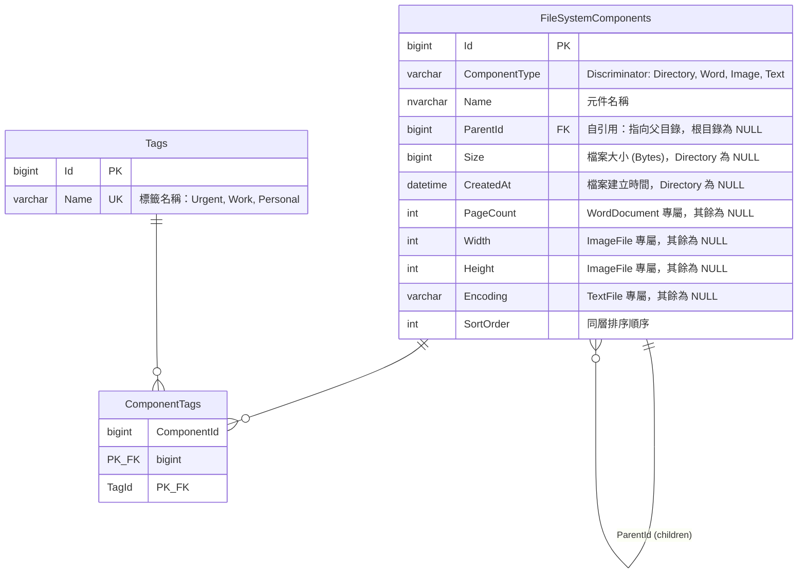

# CloudFileSystem — ER Model

採用 **Single Table Inheritance + Adjacency List** 策略，將 Composite Pattern 的遞迴樹狀結構持久化至關聯式資料庫。

## ER Diagram



## 表格設計

### FileSystemComponents（單表繼承）

| 欄位 | 型別 | 說明 |
|------|------|------|
| `Id` | BIGINT PK | 主鍵，自增 |
| `ComponentType` | VARCHAR | Discriminator：`Directory`, `Word`, `Image`, `Text` |
| `Name` | NVARCHAR | 元件名稱（支援中文） |
| `ParentId` | BIGINT FK → self | 父目錄 Id，根目錄為 NULL（Adjacency List） |
| `Size` | BIGINT NULL | 檔案大小，Directory 為 NULL |
| `CreatedAt` | DATETIME NULL | 建立時間，Directory 為 NULL |
| `PageCount` | INT NULL | WordDocument 專屬 |
| `Width` | INT NULL | ImageFile 專屬 |
| `Height` | INT NULL | ImageFile 專屬 |
| `Encoding` | VARCHAR NULL | TextFile 專屬 |
| `SortOrder` | INT | 同層排序順序，用於保持 children 的排列 |

### Tags（標籤主表）

| 欄位 | 型別 | 說明 |
|------|------|------|
| `Id` | BIGINT PK | 主鍵 |
| `Name` | VARCHAR UK | 標籤名稱，唯一約束 |

### ComponentTags（多對多關聯表）

| 欄位 | 型別 | 說明 |
|------|------|------|
| `ComponentId` | BIGINT PK, FK | 指向 FileSystemComponents.Id |
| `TagId` | BIGINT PK, FK | 指向 Tags.Id |

複合主鍵 (ComponentId, TagId) 確保同一元件不會重複標籤。

## 設計決策理由

### 為什麼用 Single Table Inheritance？

- 子類別差異小（各 1-2 個專屬欄位），nullable 成本低
- 查詢 Directory 的所有 children 只需 `WHERE ParentId = @id`，無需 JOIN
- 遞迴查詢（CTE）只涉及一張表，效能最佳

### 為什麼用 Adjacency List？

- 結構最直覺，與 Composite Pattern 的 `Parent` 屬性直接對應
- 插入/刪除/移動節點只需更新一筆 `ParentId`
- 配合 Recursive CTE 可查詢任意深度的子樹

## 與 Domain Model 的對應

| Domain 類別 | ComponentType | 專屬欄位 |
|------------|---------------|---------|
| `Directory` | `Directory` | （無，Size 和 CreatedAt 為 NULL） |
| `WordDocument` | `Word` | `PageCount` |
| `ImageFile` | `Image` | `Width`, `Height` |
| `TextFile` | `Text` | `Encoding` |

## 常用查詢範例

### 查詢目錄的直接子元件

```sql
SELECT * FROM FileSystemComponents
WHERE ParentId = @directoryId
ORDER BY SortOrder;
```

### 遞迴查詢整棵子樹

```sql
WITH RECURSIVE Subtree AS (
    SELECT * FROM FileSystemComponents WHERE Id = @rootId
    UNION ALL
    SELECT c.* FROM FileSystemComponents c
    JOIN Subtree s ON c.ParentId = s.Id
)
SELECT * FROM Subtree ORDER BY ParentId, SortOrder;
```

### 查詢元件的完整路徑

```sql
WITH RECURSIVE Ancestors AS (
    SELECT Id, Name, ParentId FROM FileSystemComponents WHERE Id = @componentId
    UNION ALL
    SELECT p.Id, p.Name, p.ParentId FROM FileSystemComponents p
    JOIN Ancestors a ON a.ParentId = p.Id
)
SELECT STRING_AGG(Name, '/') AS FullPath
FROM (SELECT Name FROM Ancestors ORDER BY Id) sub;
```

### 計算目錄總容量

```sql
WITH RECURSIVE Subtree AS (
    SELECT Id FROM FileSystemComponents WHERE Id = @directoryId
    UNION ALL
    SELECT c.Id FROM FileSystemComponents c
    JOIN Subtree s ON c.ParentId = s.Id
)
SELECT COALESCE(SUM(f.Size), 0) AS TotalSize
FROM FileSystemComponents f
WHERE f.Id IN (SELECT Id FROM Subtree)
  AND f.ComponentType != 'Directory';
```

### 依副檔名搜尋

```sql
WITH RECURSIVE Subtree AS (
    SELECT Id FROM FileSystemComponents WHERE Id = @rootId
    UNION ALL
    SELECT c.Id FROM FileSystemComponents c
    JOIN Subtree s ON c.ParentId = s.Id
)
SELECT * FROM FileSystemComponents
WHERE Id IN (SELECT Id FROM Subtree)
  AND Name LIKE '%' + @extension;
```

## 約束與索引

```sql
-- 自引用外鍵
ALTER TABLE FileSystemComponents
    ADD CONSTRAINT FK_Parent
    FOREIGN KEY (ParentId) REFERENCES FileSystemComponents(Id);

-- 查詢 children 的常用索引
CREATE INDEX IX_ParentId_SortOrder
    ON FileSystemComponents (ParentId, SortOrder);

-- 確保同層不重名
CREATE UNIQUE INDEX IX_ParentId_Name
    ON FileSystemComponents (ParentId, Name)
    WHERE ParentId IS NOT NULL;

-- 標籤關聯
ALTER TABLE ComponentTags
    ADD CONSTRAINT FK_Component FOREIGN KEY (ComponentId)
        REFERENCES FileSystemComponents(Id) ON DELETE CASCADE;
ALTER TABLE ComponentTags
    ADD CONSTRAINT FK_Tag FOREIGN KEY (TagId)
        REFERENCES Tags(Id);
```

## SortOrder 欄位設計

`SortOrder` 用於持久化 `Directory._children` 的排列順序：

- 初始插入時依序編號（10, 20, 30...留間隔方便插入）
- `sort` 指令執行後，依新順序重新編號
- 查詢 children 時 `ORDER BY SortOrder`
- `Insert(index)` 操作時，計算間隔值或重新編號
