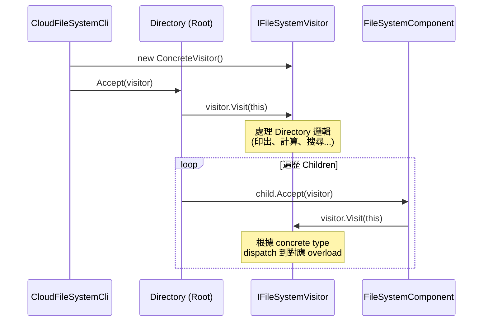
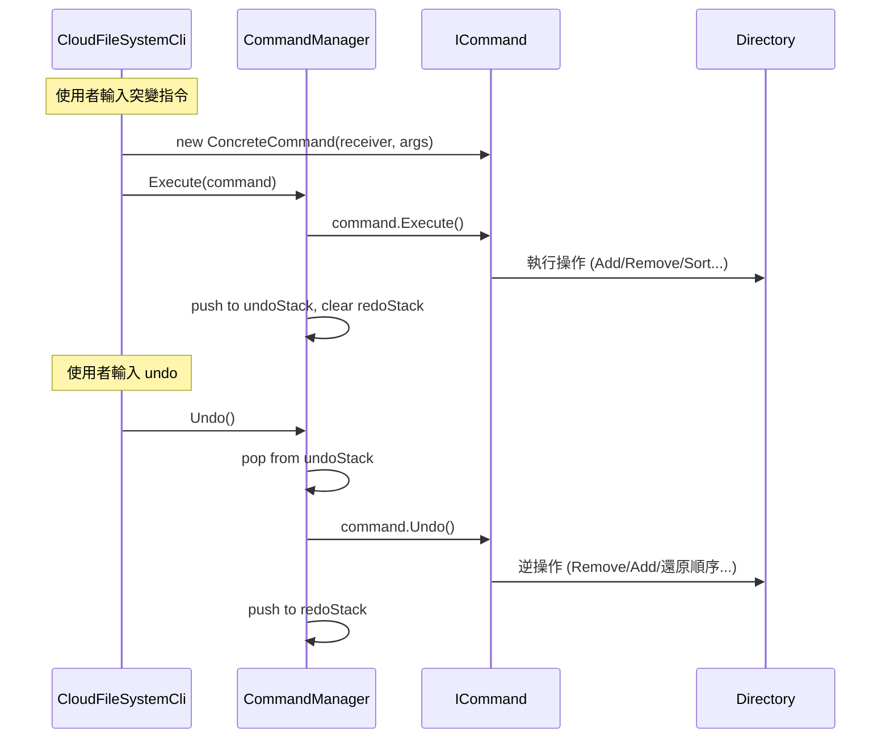

# CloudFileSystem — OOD Class Diagram

套用 Composite Pattern + Visitor Pattern + Command Pattern + Prototype Pattern 後的 UML 類別圖。

## 完整類別圖

```mermaid
classDiagram
    direction TB

    %% ===== Composite Pattern =====
    class FileSystemComponent {
        <<abstract>>
        #string Name
        +FileSystemComponent? Parent
        +HashSet~Tag~ Tags
        +GetSize()* long
        +Accept(IFileSystemVisitor visitor)* void
        +DeepCopy()* FileSystemComponent
        +GetPath() string
        +AddTag(Tag tag) void
        +RemoveTag(Tag tag) void
    }

    class Directory {
        -List~FileSystemComponent~ _children
        +IReadOnlyList~FileSystemComponent~ Children
        +Directory(string name)
        +Add(FileSystemComponent component) void
        +Remove(FileSystemComponent component) void
        +Insert(int index, FileSystemComponent component) void
        +IndexOf(FileSystemComponent component) int
        +Sort(SortBy sortBy, SortOrder sortOrder) void
        +SetChildrenOrder(IList~FileSystemComponent~ order) void
        +GetSize() long
        +Accept(IFileSystemVisitor visitor) void
        +DeepCopy() FileSystemComponent
    }

    class File {
        <<abstract>>
        +long Size
        +DateTime CreatedAt
        #File(string name, long size, DateTime createdAt)
        +GetSize() long
        +FormatSize(long bytes)$ string
    }

    class WordDocument {
        +int PageCount
        +WordDocument(string name, long size, DateTime createdAt, int pageCount)
        +Accept(IFileSystemVisitor visitor) void
        +DeepCopy() FileSystemComponent
    }

    class ImageFile {
        +int Width
        +int Height
        +ImageFile(string name, long size, DateTime createdAt, int width, int height)
        +Accept(IFileSystemVisitor visitor) void
        +DeepCopy() FileSystemComponent
    }

    class TextFile {
        +string Encoding
        +TextFile(string name, long size, DateTime createdAt, string encoding)
        +Accept(IFileSystemVisitor visitor) void
        +DeepCopy() FileSystemComponent
    }

    %% ===== Enums =====
    class Tag {
        <<enumeration>>
        Urgent
        Work
        Personal
    }

    class SortBy {
        <<enumeration>>
        Name
        Size
        Extension
    }

    class SortOrder {
        <<enumeration>>
        Asc
        Desc
    }

    %% ===== Visitor Pattern =====
    class IFileSystemVisitor {
        <<interface>>
        +Visit(Directory directory) void
        +Visit(WordDocument file) void
        +Visit(ImageFile file) void
        +Visit(TextFile file) void
    }

    class DisplayVisitor {
        -StringBuilder _outputBuilder
        -List~bool~ _isLast
        +GetOutput() string
        +Visit(Directory directory) void
        +Visit(WordDocument file) void
        +Visit(ImageFile file) void
        +Visit(TextFile file) void
    }

    class SizeCalculatorVisitor {
        +long TotalSize
        +Visit(Directory directory) void
        +Visit(WordDocument file) void
        +Visit(ImageFile file) void
        +Visit(TextFile file) void
    }

    class SearchByExtensionVisitor {
        -string _targetExtension
        +List~string~ Results
        +SearchByExtensionVisitor(string extension)
        +Visit(Directory directory) void
        +Visit(WordDocument file) void
        +Visit(ImageFile file) void
        +Visit(TextFile file) void
    }

    class XmlExportVisitor {
        -StringBuilder _xmlBuilder
        -int _indentLevel
        +string GetXml()
        +Visit(Directory directory) void
        +Visit(WordDocument file) void
        +Visit(ImageFile file) void
        +Visit(TextFile file) void
    }

    %% ===== Command Pattern =====
    class ICommand {
        <<interface>>
        +Execute() void
        +Undo() void
        +string Description
    }

    class CommandManager {
        -Stack~ICommand~ _undoStack
        -Stack~ICommand~ _redoStack
        +Execute(ICommand command) void
        +Undo() void
        +Redo() void
        +bool CanUndo
        +bool CanRedo
    }

    class DeleteCommand {
        -Directory _parent
        -FileSystemComponent _component
        -int _originalIndex
        +Execute() void
        +Undo() void
    }

    class PasteCommand {
        -Directory _target
        -FileSystemComponent _clipboard
        -FileSystemComponent _cloned
        +Execute() void
        +Undo() void
    }

    class SortCommand {
        -Directory _directory
        -SortBy _sortBy
        -SortOrder _sortOrder
        -List~FileSystemComponent~ _originalOrder
        +Execute() void
        +Undo() void
    }

    class TagCommand {
        -FileSystemComponent _component
        -Tag _tag
        +Execute() void
        +Undo() void
    }

    class UntagCommand {
        -FileSystemComponent _component
        -Tag _tag
        +Execute() void
        +Undo() void
    }

    %% ===== I/O Abstraction =====
    class IConsole {
        <<interface>>
        +ReadLine() string?
        +Write(string text) void
        +WriteLine(string text) void
        +WriteError(string text) void
    }

    class SystemConsole {
        +ReadLine() string?
        +Write(string text) void
        +WriteLine(string text) void
        +WriteError(string text) void
    }

    %% ===== CLI =====
    class CloudFileSystemCli {
        -Directory _root
        -IConsole _console
        -CommandManager _commandManager
        -FileSystemComponent? _clipboard
        +CloudFileSystemCli(Directory root, IConsole console)
        +Start() void
        -ExecuteCommand(string command) void
    }

    %% ===== Inheritance (Composite) =====
    FileSystemComponent <|-- Directory
    FileSystemComponent <|-- File
    File <|-- WordDocument
    File <|-- ImageFile
    File <|-- TextFile

    %% ===== Composition: Directory holds children =====
    Directory "1" *-- "0..*" FileSystemComponent : children

    %% ===== Tags =====
    FileSystemComponent "1" o-- "0..*" Tag : tags

    %% ===== Visitor implements =====
    IFileSystemVisitor <|.. DisplayVisitor
    IFileSystemVisitor <|.. SizeCalculatorVisitor
    IFileSystemVisitor <|.. SearchByExtensionVisitor
    IFileSystemVisitor <|.. XmlExportVisitor

    %% ===== Command implements =====
    ICommand <|.. DeleteCommand
    ICommand <|.. PasteCommand
    ICommand <|.. SortCommand
    ICommand <|.. TagCommand
    ICommand <|.. UntagCommand

    %% ===== CommandManager holds commands =====
    CommandManager o-- ICommand : history

    %% ===== I/O implements =====
    IConsole <|.. SystemConsole

    %% ===== Dependencies =====
    FileSystemComponent ..> IFileSystemVisitor : Accept(visitor)
    CloudFileSystemCli --> Directory : _root
    CloudFileSystemCli --> IConsole : _console
    CloudFileSystemCli --> CommandManager : _commandManager
    DeleteCommand --> Directory : _parent
    DeleteCommand --> FileSystemComponent : _component
    PasteCommand --> Directory : _target
    PasteCommand --> FileSystemComponent : _clipboard
    SortCommand --> Directory : _directory
    TagCommand --> FileSystemComponent : _component
    UntagCommand --> FileSystemComponent : _component
```



## 設計模式角色對照

### Composite Pattern

| GoF 角色 | 本專案類別 | 說明 |
|----------|-----------|------|
| **Component** | `FileSystemComponent` | 抽象基底類別，定義 `GetSize()`、`Accept()`、`DeepCopy()` 統一介面 |
| **Composite** | `Directory` | 持有 `List<FileSystemComponent>` children，`GetSize()` 遞迴加總，`DeepCopy()` 遞迴複製子樹 |
| **Leaf** | `File` (abstract) → `WordDocument`, `ImageFile`, `TextFile` | `GetSize()` 回傳自身 `Size`，`DeepCopy()` 複製自身屬性 |

### Visitor Pattern

| GoF 角色 | 本專案類別 | 說明 |
|----------|-----------|------|
| **Visitor** | `IFileSystemVisitor` | 定義 `Visit()` overloads，每種 concrete element 一個 |
| **ConcreteVisitor** | `DisplayVisitor`, `SizeCalculatorVisitor`, `SearchByExtensionVisitor`, `XmlExportVisitor` | 各自實作一種遍歷操作 |
| **Element** | `FileSystemComponent` | 定義 `Accept(IFileSystemVisitor)` |
| **ConcreteElement** | `Directory`, `WordDocument`, `ImageFile`, `TextFile` | 實作 `Accept()` → 呼叫 `visitor.Visit(this)` |

### Command Pattern

| GoF 角色 | 本專案類別 | 說明 |
|----------|-----------|------|
| **Command** | `ICommand` | 介面：`Execute()`、`Undo()`、`Description` |
| **ConcreteCommand** | `DeleteCommand`, `PasteCommand`, `SortCommand`, `TagCommand`, `UntagCommand` | 各自封裝一種突變操作與其逆操作 |
| **Invoker** | `CommandManager` | 持有兩個 `Stack<ICommand>` 管理 undo/redo 歷史 |
| **Client** | `CloudFileSystemCli` | 建立對應 Command 物件，交給 CommandManager 執行 |
| **Receiver** | `Directory`, `FileSystemComponent` | 實際被操作的領域物件 |

### Prototype Pattern

| GoF 角色 | 本專案類別 | 說明 |
|----------|-----------|------|
| **Prototype** | `FileSystemComponent` | 定義 `abstract DeepCopy()` |
| **ConcretePrototype** | `Directory`, `WordDocument`, `ImageFile`, `TextFile` | 各自實作深拷貝邏輯。`Directory` 遞迴呼叫 `child.DeepCopy()` 並透過 `Add()` 維護 `Parent` 參照 |
| **Client** | `PasteCommand` | 呼叫 `clipboard.DeepCopy()` 建立獨立副本 |

## Accept / Visit 互動流程



## Command Execute / Undo 互動流程



## Traverse Log 整合方式

功能三要求在執行操作時印出走訪節點順序。每個 Visitor 的 `Visit()` 方法開頭加入：

```csharp
Console.WriteLine($"Visiting: {directory.GetPath()}");
// 或
Console.WriteLine($"Visiting: {file.GetPath()}");
```

這樣每次遍歷都會自動產生類似以下的 log：

```
Visiting: Root
Visiting: Root/Project_Docs
Visiting: Root/Project_Docs/需求規格書.docx
Visiting: Root/Project_Docs/系統架構圖.png
...
```
